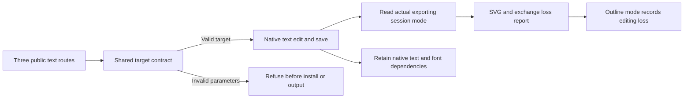

# SVG text delivery and explicit targeting

Development plugin53 pins independent source39. Direct workflows, native.command and complete-command plans share the text edit validator. They require explicit id or ids and string text, rejecting implicit selection, empty targets, boolean IDs and font replacement parameters.

SVG appearance mode records live-text-editability=lost; editable mode with text nodes records observed. Unknown mode or paths alone cannot establish outlining. Font portability remains unknown. Native document text IDs do not establish visibility on an artboard or a mapping to individual outlines.

Source39 candidate checks include151 passed/30 skipped, real Chinese revision, brand consumer isolation, same-color nonconsumer preservation, two native SVG modes and18 invalid-route refusals. See the [independent source report](https://github.com/full-aigc-skills/vectorcraft-skills/blob/v0.1.0-dev.39/docs/evidence/text-outline-candidate39-20261009.json). Fixed52 installation and native qualification are recorded separately; tasks4.7–4.9 are complete; full V1 remains open. Historical51 evidence retains its original execution bytes and is not rebound to52.

Development53 corrects historical test-byte archival. Production skills match fixed52, which passed isolated host discovery of13 skills, two native text exports and18 refusals. Tasks4.7–4.9 are qualified against fixed53.

Public fixed53/source39 qualifies all four VC-DM-003 scenarios; tasks4.7–4.9 complete,102 tasks complete/25 open. Eight injected brand faults, healthy/same-RGB isolation, Chinese revision and independent reopen, original-stage text refusals, two SVG text modes,18 route refusals and30 source tests passed;13 skill digests unchanged. Faults are explicit QA injection, native font-library status does not establish OS-font inventory, GUI or cross-editor fidelity. [Scenario evidence](evidence/vectorcraft-brand-text-fixed53-20261009.json).
