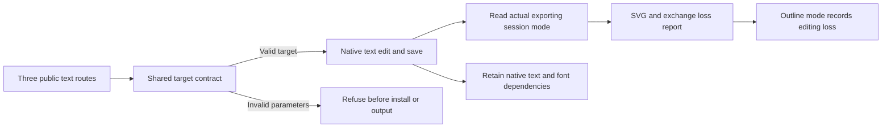

# SVG text delivery and explicit targeting

Development plugin52 pins independent source39. Direct workflows, native.command and complete-command plans share the text edit validator. They require explicit id or ids and string text, rejecting implicit selection, empty targets, boolean IDs and font replacement parameters.

SVG appearance mode records live-text-editability=lost; editable mode with text nodes records observed. Unknown mode or paths alone cannot establish outlining. Font portability remains unknown. Native document text IDs do not establish visibility on an artboard or a mapping to individual outlines.

Source39 candidate checks include151 passed/30 skipped, real Chinese revision, brand consumer isolation, same-color nonconsumer preservation, two native SVG modes and18 invalid-route refusals. See the [independent source report](https://github.com/full-aigc-skills/vectorcraft-skills/blob/v0.1.0-dev.39/docs/evidence/text-outline-candidate39-20261009.json). Fixed52 installation and native qualification are recorded separately; tasks4.7–4.9 and full V1 remain open. Historical51 evidence retains its original execution bytes and is not rebound to52.
