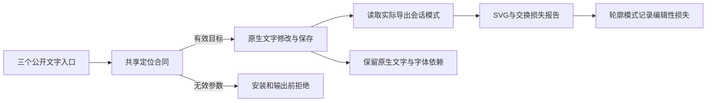

# SVG 文字交付与显式定位

开发插件53锁定独立技能源39。普通工作流、native.command 与完整命令入口共用文字修改校验，要求显式 id 或 ids 以及字符串 text；拒绝隐式选区、空目标、布尔ID和附带字体替换。

SVG 的 appearance 模式记录 live-text-editability=lost；editable 模式存在文字节点时记录 observed。未知模式或只有路径不足以证明轮廓化。字体可移植性继续为 unknown，文档文字ID不能证明对象在画板内可见，也不构成逐轮廓映射。

源39候选验证包括151项通过／30项跳过、真实中文修订、品牌消费者隔离、同色非消费者保留，以及两种原生SVG模式与18项入口拒绝。候选报告见[独立技能源证据](https://github.com/full-aigc-skills/vectorcraft-skills/blob/v0.1.0-dev.39/docs/evidence/text-outline-candidate39-20261009.json)。固定52安装及原生验收另行登记；4.7–4.9已完成，完整V1仍开放。历史51证据保留原始执行字节，不重绑定到52。

开发53修正历史测试字节归档，生产技能与固定52一致；52已通过隔离宿主13技能发现、两种文字导出及18项拒绝。4.7–4.9已按固定53逐场景证据完成。

公开固定53／源39完成VC-DM-003全部四场景，任务4.7–4.9完成，当前102项完成／25项开放。8组品牌误改注入、正常品牌／同色隔离、中文返工及独立重开、原位置文字拒绝、两种SVG文字模式、18项入口拒绝和30项目标源测试通过；13技能摘要保持不变。故障为QA显式注入，字体状态仅来自原生库，不声称GUI、全富文本或跨编辑器保真。[逐场景证据](evidence/vectorcraft-brand-text-fixed53-20261009.json)。
