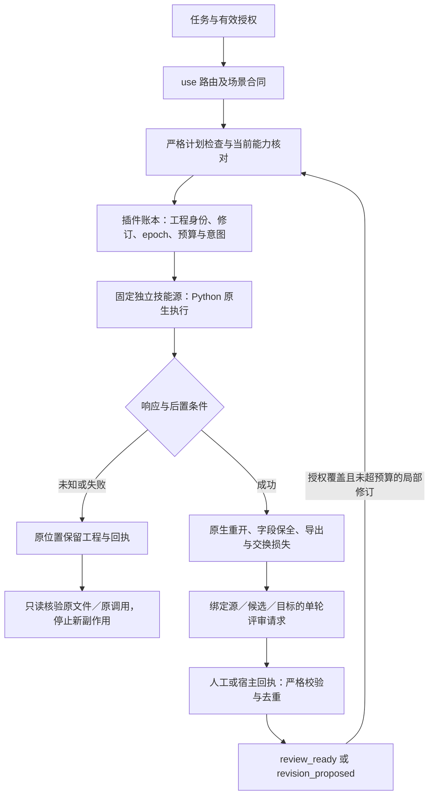

# VectorCraft V1 Design

## Context

动机和边界见 [proposal.md](proposal.md)。当前只有文档、元数据与运行时基础证据；专业技能、Harness 和原生交付验收仍待实现。VectorCraft 的代表任务是：制作 Logo 与图标资产，交付 .vectorcraft、SVG 和 PNG；修改品牌色后更新所有绑定的变体，并保留无关颜色。

## Goals / Non-Goals

**Goals:** 独立技能分发、可信运行时、声明式计划编译、可恢复任务、原生工程与导出双重交付，以及可追溯质量结论。

**Non-Goals:** 不重写上游应用，不实现 SaaS，不把原生交付降为只有图片/视频，未通过原生交付与宿主验收前不宣称插件已完成。

## Decisions

1. 独立 `vectorcraft-skills` 是知识事实源，插件同步不可变发布副本；替代方案“插件内手工维护一套技能”会形成漂移，予以拒绝。
2. 官方 CLI/MCP 是执行端，适配器编译声明式计划并核对能力；替代方案“LLM 直接拼接任意 shell”无法保证接口和副作用边界。
3. 拟采用 TypeScript/Node.js 24 LTS、SQLite 与内容寻址文件。替代方案云数据库/队列对本地单用户 V1 没有必要，出现跨机器需求后另提变更。
4. 副作用先写意图和幂等键；不明确结果保留工程占用并 reconcile。替代方案超时自动重试会产生重复编辑或重复计费。
5. 公共协议由 ArtCraft 规范持有，领域仓只拥有自己的 payload 与映射。替代方案每个插件独立定义公共 JSON 将导致不兼容。
6. 技术验证与创作评估分离，已有有效用户授权持续生效；只在超范围动作或修改授权约束时要求新的授权。

## Component design

完整中英文运行时设计位于 [中文架构](../../../docs/VectorCraft-Runtime-Architecture.zh_CN.md) 和 [English architecture](../../../docs/VectorCraft-Runtime-Architecture.md)。领域计划对象包括 VectorDesignPlan, Document, PathObject, Artboard, BrandToken，以下能力逐项编译：

| 能力 | 行为边界 | 状态 |
| :--- | :--- | :--- |
| 路径形状与坐标 | 定义画板坐标、单位、路径控制点、闭合性与描边；不可把预览像素当成路径事实。 | 计划中 |
| 组合与布尔操作 | 记录参与对象 ID、布尔运算与结果对象身份，保留修改前检查点；操作失败不丢失原对象。 | 计划中 |
| 品牌色与文字 | 以显式 token 绑定品牌色而非全文件颜色替换；保留文本内容与字体依赖，轮廓化输出记录可编辑性损失。 | 计划中 |
| 画板与变体 | 每个画板有稳定 ID、名称、尺寸和输出映射；预览顺序与导出范围明确，避免索引基准混淆。 | 源40最小实现；完整验收开放 |
| 交换格式能力范围 | 原生 .vectorcraft 与 SVG、PDF、PNG 分别验证；遇到不可交换效果时报告栅格化范围并保留原工程。 | 计划中 |
| 品牌变体更新 | 根据 token 与素材依赖更新相关变体，核对无关对象属性与输出没有变化。 | 计划中 |

## State and recovery

核心状态为 planned、blocked、ready、running、reconciling、verifying、review_ready、completed、failed、cancel_requested、cancelled。同一原生工程单写；状态写入采用 epoch 防止过期执行者提交。原生应用不是账本事务的一部分，需要用检查点、文件核验和 reconciliation 收敛。父编排器不能将 accepted 当 completed，也不重复承担子插件的副作用重试。

## Risks / Trade-offs

| 风险 | 发现方式 | 处理与责任人 |
| :--- | :--- | :--- |
| R1 | 上游命令或格式变化 | Runtime owner：固定版本，比较 schema，重跑 fixture；未通过保持旧版 |
| R2 | 文字、透明或颜色交接损失 | Domain owner：保存源工程，生成 loss report，使用像素与对象检查 |
| R3 | 断线导致重复提交 | Harness owner：持久化意图与幂等键，先 reconcile，再决定重试 |
| R4 | 文档被误读为已实现 | Release owner：功能状态为 planned；无技能和运行时入口不得进市场 |
| R5 | ArtCraft 商标和受限许可代码边界 | Maintainer：独立实现；不复制上游 ArtCraft/Services 代码；品牌授权在发行前核对 |

## Migration Plan

新仓库无历史插件状态迁移。按 M1 运行时与技能 → M2 专业闭环 → M3 跨插件 → M4 宿主发布推进；ArtCraft 公共协议先定义，真实跨插件验收在领域端就绪后执行。升级采用版本目录与排空，保留旧组合；涉及状态 schema 时先备份，禁止不兼容回退。文档基线不进入可安装市场。

## Validation strategy

每条规范通过正向和失败场景验收；任务表关联需求 ID、测试与产物。验收覆盖清洁安装、原生重开、输出解码/像素检查、局部修改、中断恢复、重复调用与宿主加载。元数据检查、MCP 握手与单次调用不能替代完整创作验收。

## Deferred measurements

具体渲染吞吐、峰值内存、macOS x64/Windows/Linux 和各宿主版本兼容性必须通过 M2/M4 测量后填写，不影响当前本地优先架构与任务分解。名称与品牌资源使用由维护者在发行门禁核对。

## 交换报告实施决策

报告生成器属于各独立技能源，插件仅消费不可变快照。报告绑定原生、重开记录与导出摘要；lost/observed/unknown 不互相提升。ArtCraft 严格核验报告结构和实际文件，不允许 nativeSubstitute；历史无报告的交付不补造证据。实现与真实回归已验证，跨编辑器完整保真任务仍待验收。

## CLI 场景技能增量设计

参考 Dreamina 的 use / CLI / setup / 业务场景分层，但按真实命令划分任务。四原生 CLI 保持各自 argv 和工程保存语义；每个技能打包自己的最小运行资源，禁止跨技能文件路径。共有资源在仓库发布脚本中按摘要同步，避免手工维护多份逻辑。上游 ArtCraft 的 scene 保存、生成请求与异步轮询仅作为设计参考，不复制受限代码；本项目 ArtCraft CLI 的事实源为现有 src/cli.ts。原有 use 公开入口保持兼容。插件从新不可变技能源标签同步全部清单，宿主验收锁按新版本单独更新。

## 品牌依赖守卫增量（2026-10-08）

现有依赖保全测试不能替代执行时核验。VC-DM-006-GUARD由独立技能源的brand_variants.py与workflow.py实现：显式色板消费者、非消费者自身属性、对象增删／顺序和画板范围检查；修改前原生检查点保留在失败原暂存目录。成功只保留检查点摘要和依赖报告，不迁移含绝对链接的中间工程。当前为源码候选，固定发行、实际安装与Art内置领域包仍待分别验证。

## Dreamina 对照优化增量（2026-10-08）

本节更新的是后续实施设计。上述初始设计和候选阶段描述保留历史上下文；当前有界完成情况以 tasks 和绑定版本的证据为准。VC-DM-006 的 4.27–4.30 已有候选及固定安装证据，不能据此推定新增 VC-DM-008 的消费者字段与期望值检查已通过。本次不修改运行代码，不迁移规格体系，不同步或归档当前 change。

### 分析基线与尚存缺口

分析时插件为 dev.37，固定技能源 dev.33，包含 13 项技能；技能执行锁为 CLI 0.2.0-craft.2，桌面为 0.2.0。根运行时锁仍呈现官方 0.2.0 基线，源套件与源发布清单存在 dev.33／dev.32 差异。旧状态仍引用 58 技能矩阵，而较新跨插件证据记录 64 项。此处为分析快照，不是永久版本常量；VC-RL-003／VC-AR-003 的任务负责建立可校验的当前身份和证据入口。

普通工作流的计划读取与 Session.command 内层处理仍有宽松 JSON 路径，不能因完整命令入口已有严格解析而视为统一完成。只读模拟回执探针观察到重复键被后值覆盖、1e999 进入无穷值、原生错误对象作为普通字典返回。品牌检查探针观察到绑定消费者的 closed 或文字内容变化未被拒绝，未发生期望改色也未报告差异。这些是源码与模拟探针证据，不是原生事故复现，也不替代实施阶段的自动化失败测试、原生候选或固定安装验证。

目录包含 585 项命令但逐命令 executionAcceptance 为 NOT_RUN；代表创作、单技能冷启动、桌面操作及品牌变体的现有证据各有独立范围。插件尚无完整 `src/` Harness 与 `schemas/` 实现；保留既定 TypeScript／Node.js 24／SQLite 目标，现有 Python 原生工作流继续由独立技能源持有。目录、文档和目标模块不能被描述为已经实现。

### 可借鉴的机制与迁移边界

| Dreamina 机制 | Vector 适用方式 | 需求／任务 |
| :--- | :--- | :--- |
| use 路由与原子技能操作合同、宿主隐式调用配置 | use 默认路由，场景技能显式可用；13 项保持自包含，减少重复描述而非删除单技能必需脚本 | VC-SK-004；9.7–9.9 |
| judge_exchange 的持久化请求、目标／候选摘要及严格回执 | 采用 Vector 结构、文字、品牌和小尺寸可辨识性 rubric；人工或宿主评审，不因该设计自动启动其他 Agent | VC-QA-003；9.19–9.21 |
| prompt_revision 在变更前重读状态 | 对源工程修订、源文件、目标指纹重新比对，只修改允许对象与字段 | VC-QA-002；6.4–6.6 |
| loop_state 先落意图、未知结果先查原任务 | 本地工程／步骤／会话身份和原位置检查点，不能假定 native command 自带幂等或远端查询 | VC-TX-001／002；3.1–3.6 |
| round_safety 的跨重启预算与取消状态 | 共享时间、重试及输出资源预算，保留原生执行占用与迟到产物，不照搬积分结算 | VC-TX-003；3.7–3.9 |
| schema 校验、版本证据与分层验证 | 收敛普通／网关解析差异，建立当前索引及两仓 CI，保持候选／固定安装／GUI／全命令边界 | VC-TX-005、VC-AR-003、VC-RL-003／004 |

Dreamina 自身仍有单轮、宿主介导 Judge 和部分集成边界，不能当作已经验证的通用自动闭环。Vector 不新增虚构登录、付费审批或远端 submitId；不移植图片光照／材质评分作为矢量质量标准。品牌消费者字段保全是 Vector 自身需要补齐的合同，不能由复用 Dreamina 编排解决。

### 责任归属与目标调用关系

| 仓库／边界 | 持有内容 | 本次与后续范围 |
| :--- | :--- | :--- |
| vectorcraft-skills | workflow、commands、mcp_session、brand_variants；13 项技能及确定性同步；源仓测试／CI | 后续实施严格解析、字段检查、技能合同；本次不编辑源仓 |
| vectorcraft-plugin | 当前 change；固定来源校验、插件元数据、证据索引；目标 Harness／评审协调 | 本次仅规范及任务，未来锁定已发布技能快照，不手改内置技能 |
| research/vectorcraft | 原生 API、能力与格式参考 | 只读；发现上游缺陷另行界定范围，不在 research 修复 |
| artcraft-plugin | 公共 craft-task/v1、craft-artifact/v1 与父级编排 | Vector 只定义领域映射；Art 内置领域包升级另验，不复制公共协议事实源 |

以下为目标流程；当前 Python 原生执行已有有界实现，插件账本与评审协调仍须完成任务验收。

图中返回边仅表示经当前授权与预算核对的受限修订，单轮结果不会自行启动下一轮。源工程占用与输出路径互相独立：同一活动文档即使输出不同也只能单写，不可变源快照的独立文档分支可并行。父进程退出不能证明原生子进程停止；epoch 失效的旧执行者不能提交。修改前检查点可能含绝对链接，失败时留在原路径核验，不随成功交付盲目搬迁。

### 实施顺序、兼容性与验收

| 顺序 | 优先级与需求 | 验收重点 |
| :--- | :--- | :--- |
| A | P0：VC-TX-005、VC-DM-008 | 自动化目标红灯→最小修复→两入口回归→原生候选→固定安装；拒绝错误成功且保全原文件 |
| B | P1：VC-SK-004、VC-RL-003、VC-AR-003 | 自包含路由与合同、版本一致、证据指纹失效／复用；不追认未运行场景 |
| C | P1：VC-RL-004；既有 VC-TX-001／002／003 | 两仓持续验证与发行矩阵；持久化意图、工程单写、恢复、取消、共享预算按原任务完成 |
| D | P2：VC-QA-003；既有 VC-QA-001／002 | 单轮评审及回执，基于实时版本和有效授权的局部修订；技术失败不可被视觉得分覆盖 |

新的严格解析保留两种公开计划格式及合法数据语义；不能仅看到业务字段 error 就报错。品牌检查以实际绑定外观字段为允许清单，已达到请求值时明确 verified_noop；不存在消费者或目标未达成不假装成功。导出继承、显式空列表、源计划摘要和 PDF 日期／无关输出字节合同继续保留。

9.1–9.21 均为新待实施任务。3.1–3.9 对新增单写／恢复／取消场景负责，6.4–6.6 对实时版本与授权边界负责，2.4–2.6 的运行能力／隔离升级及 8.3 的全量命令门禁继续开放。新规范不撤销既有有界验收，也不为它们补造新场景证据。发布、安装、跨仓代码修改和市场动作不因本次文档变更自动执行。

## 画板映射增量（源40／插件54）

workflow.py在实际源工程打开后读取原生画板身份，在独立重开后由artboard_mapping.py一次校验全部导出。旧索引返工绑定原ID，显式artboardId跟随当前顺序；artboard.new原生索引回执经同会话查询补充实际ID别名。输出记录名称、矩形尺寸和实际索引，PNG预览顺序遵循明确请求顺序。首次导出前拒绝冲突、未知ID与重复输出；不修改公共craft-artifact根合同。SVG绘制范围隔离与PDF日期仍按既有原生能力执行，不由映射候选子集关闭4.12。
