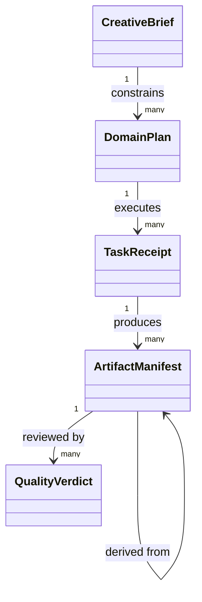

# VectorCraft — 领域模型设计

> **文档说明**：产品级边界与跨版本决策。
>
> **版本**：1.0.0
> **最后更新**：2026-10-05
> **状态**：目标设计；尚未实现。事实依据与验收结果单独标注。

关联文档：[品牌边界](1%E3%80%81VectorCraft-%E5%91%BD%E5%90%8D%E4%B8%8E%E5%93%81%E7%89%8C%E8%AF%B4%E6%98%8E.md) · [技术方案](5%E3%80%81VectorCraft-%E6%8A%80%E6%9C%AF%E6%96%B9%E6%A1%88%E4%B8%8E%E8%B7%AF%E7%BA%BF.md) · [详细架构](../../docs/VectorCraft-Runtime-Architecture.zh_CN.md) · [OpenSpec](../../openspec/changes/establish-v1-plugin/proposal.md) · [证据](../../docs/evidence/runtime-baseline.json)

## 1. 聚合与权威

| 组件 | 权威数据 | 禁止承担 |
| :--- | :--- | :--- |
| Skills | 操作知识、触发条件、领域方法 | 任务状态和秘密 |
| Domain Harness | 领域计划、工程修订、子任务账本 | 其他插件内部状态 |
| Runtime Adapter | 命令映射与能力快照 | 自行改变创作目标 |
| Native CLI | 原生对象、编辑与渲染 | 跨插件项目真相 |
| ArtCraft | Brief、DAG、资产版本与聚合交付 | 伪造子任务成功 |

## 2. 领域对象

| Object | 约束 |
| :--- | :--- |
| VectorDesignPlan | 稳定身份、显式版本；修改需由所属聚合校验 |
| Document | 稳定身份、显式版本；修改需由所属聚合校验 |
| PathObject | 稳定身份、显式版本；修改需由所属聚合校验 |
| Artboard | 稳定身份、显式版本；修改需由所属聚合校验 |
| BrandToken | 稳定身份、显式版本；修改需由所属聚合校验 |

## 3. 关系模型

## 4. 领域事件与一致性

事件包含 plan.created、execution.started、execution.outcome_unknown、artifact.verified、review.accepted、revision.invalidated。事件是追加审计，账本当前状态由事务更新；事件重放必须幂等。素材依赖禁止循环；已验收版本不可原地变更。具体协议字段由 ArtCraft 公共规范持有。

---

**文档版本**：1.0.0
**创建日期**：2026-10-05
**最后更新**：2026-10-05
**文档状态**：待评审；实现以 OpenSpec 任务和证据为准。
