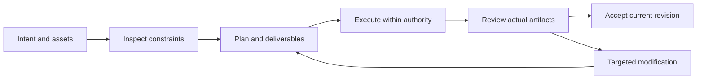

# VectorCraft V1 — 功能与界面规划

> **文档说明**：V1 实施阅读视图；规范事实源为 OpenSpec。
>
> **版本**：1.0.0
> **最后更新**：2026-10-05
> **状态**：目标设计；尚未实现。事实依据与验收结果单独标注。

关联文档：[品牌边界](../1%E3%80%81VectorCraft-%E5%91%BD%E5%90%8D%E4%B8%8E%E5%93%81%E7%89%8C%E8%AF%B4%E6%98%8E.md) · [技术方案](../5%E3%80%81VectorCraft-%E6%8A%80%E6%9C%AF%E6%96%B9%E6%A1%88%E4%B8%8E%E8%B7%AF%E7%BA%BF.md) · [详细架构](../../../docs/VectorCraft-Runtime-Architecture.zh_CN.md) · [OpenSpec](../../../openspec/changes/establish-v1-plugin/proposal.md) · [证据](../../../docs/evidence/runtime-baseline.json)

## 1. V1 功能模块

| 能力 | 行为边界 | 状态 |
| :--- | :--- | :--- |
| 路径形状与坐标 | 定义画板坐标、单位、路径控制点、闭合性与描边；不可把预览像素当成路径事实。 | 计划中 |
| 组合与布尔操作 | 记录参与对象 ID、布尔运算与结果对象身份，保留修改前检查点；操作失败不丢失原对象。 | 计划中 |
| 品牌色与文字 | 以显式 token 绑定品牌色而非全文件颜色替换；保留文本内容与字体依赖，轮廓化输出记录可编辑性损失。 | 计划中 |
| 画板与变体 | 每个画板有稳定 ID、名称、尺寸和输出映射；预览顺序与导出范围明确，避免索引基准混淆。 | 计划中 |
| 交换格式能力范围 | 原生 .vectorcraft 与 SVG、PDF、PNG 分别验证；遇到不可交换效果时报告栅格化范围并保留原工程。 | 计划中 |
| 品牌变体更新 | 根据 token 与素材依赖更新相关变体，核对无关对象属性与输出没有变化。 | 计划中 |

## 2. 宿主流程

## 3. 界面载体与责任

宿主展示计划卡、任务状态、预览与交付链接；原生编辑器承担精细人工编辑。诊断 JSON 供维护者读取，用户默认看到问题含义、影响范围与可执行恢复动作。

## 4. 异常状态

无素材显示缺失清单；无能力显示不支持项；执行中显示真实进度或未知进度；取消待确认保留占用；验收失败展示失败门禁与证据；不显示伪造百分比。

---

**文档版本**：1.0.0
**创建日期**：2026-10-05
**最后更新**：2026-10-05
**文档状态**：待评审；实现以 OpenSpec 任务和证据为准。
