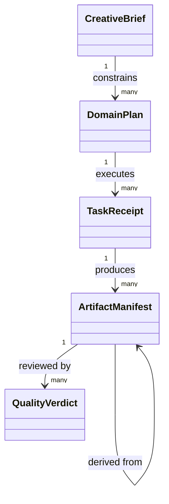

# VectorCraft — Domain-Model

> **Purpose**: Product boundaries and cross-version decisions.
>
> **Version**: 1.0.0
> **Updated**: 2026-10-05
> **Status**: Target design, not implemented. Observations and acceptance evidence are identified separately.

Related documents: [Brand boundary](1%E3%80%81VectorCraft-Naming-and-Brand.md) · [Technical plan](5%E3%80%81VectorCraft-Technical-Plan.md) · [Detailed architecture](../../../docs/VectorCraft-Runtime-Architecture.md) · [OpenSpec](../../../openspec/changes/establish-v1-plugin/proposal.md) · [Evidence](../../../docs/evidence/runtime-baseline.json)

## 1. Aggregates and authority

| Component | Authoritative data | Must not own |
| :--- | :--- | :--- |
| Skills | Procedural knowledge, triggers and domain methods | Task state or secrets |
| Domain Harness | Domain plans, project revisions and child task ledger | Other plugins’ internal state |
| Runtime Adapter | Command mappings and capability snapshots | Changing creative goals |
| Native CLI | Native objects, edits and rendering | Cross-plugin project authority |
| ArtCraft | Brief, DAG, asset versions and aggregate delivery | Fabricating child success |

## 2. Domain objects

| Object | Invariant |
| :--- | :--- |
| VectorDesignPlan | Stable identity and explicit revision; mutations validated by its owning aggregate |
| Document | Stable identity and explicit revision; mutations validated by its owning aggregate |
| PathObject | Stable identity and explicit revision; mutations validated by its owning aggregate |
| Artboard | Stable identity and explicit revision; mutations validated by its owning aggregate |
| BrandToken | Stable identity and explicit revision; mutations validated by its owning aggregate |

## 3. Relationship model

## 4. Domain events and consistency

Events include plan.created, execution.started, execution.outcome_unknown, artifact.verified, review.accepted and revision.invalidated. Events provide append-only audit; current ledger state changes transactionally and replay must be idempotent. Asset dependencies cannot cycle and accepted versions cannot mutate in place. ArtCraft’s public specifications own protocol fields.

---

**Document version**: 1.0.0
**Created**: 2026-10-05
**Updated**: 2026-10-05
**Document status**: Ready for review; implementation status is governed by OpenSpec tasks and evidence.
