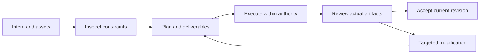

# VectorCraft V1 — Interaction-Plan

> **Purpose**: V1 implementation reading view; OpenSpec is normative.
>
> **Version**: 1.0.0
> **Updated**: 2026-10-05
> **Status**: Target design, not implemented. Observations and acceptance evidence are identified separately.

Related documents: [Brand boundary](../1%E3%80%81VectorCraft-Naming-and-Brand.md) · [Technical plan](../5%E3%80%81VectorCraft-Technical-Plan.md) · [Detailed architecture](../../../../docs/VectorCraft-Runtime-Architecture.md) · [OpenSpec](../../../../openspec/changes/establish-v1-plugin/proposal.md) · [Evidence](../../../../docs/evidence/runtime-baseline.json)

## 1. V1 functional modules

| Capability | Behavioral boundary | Status |
| :--- | :--- | :--- |
| Paths, shapes and coordinates | Define artboard coordinates, units, control points, path closure and strokes; preview pixels are not vector path authority. | Planned |
| Grouping and boolean operations | Record operand IDs, boolean operation and result identity with a pre-operation checkpoint; failure must not destroy source objects. | Planned |
| Brand colors and text | Bind brand colors using explicit tokens instead of global color replacement; retain text and font dependencies and report editability loss when outlining. | Planned |
| Artboards and variants | Give each artboard a stable ID, name, size and output mapping; define preview ordering and export ranges without index-base ambiguity. | Planned |
| Interchange fidelity scope | Validate native .vectorcraft, SVG, PDF and PNG separately; report rasterized effects and keep native sources when interchange cannot preserve them. | Planned |
| Brand variant revision | Update related variants from token and asset dependencies and verify that unrelated object properties and outputs remain unchanged. | Fixed56 six-scenario acceptance passed (macOS arm64; GUI/model separate) |

## 2. Host journey

## 3. Surfaces and responsibilities

The host presents plans, task states, previews and delivery links; native editors support detailed manual editing. Diagnostic JSON is for maintainers; users see the issue, affected scope and actionable recovery.

## 4. Exceptional states

Missing assets show a checklist; missing capabilities show unsupported operations; running tasks show real or explicitly unknown progress; pending cancellation retains occupancy; failed acceptance shows gates and evidence. Do not fabricate progress percentages.

---

**Document version**: 1.0.0
**Created**: 2026-10-05
**Updated**: 2026-10-05
**Document status**: Ready for review; implementation status is governed by OpenSpec tasks and evidence.
